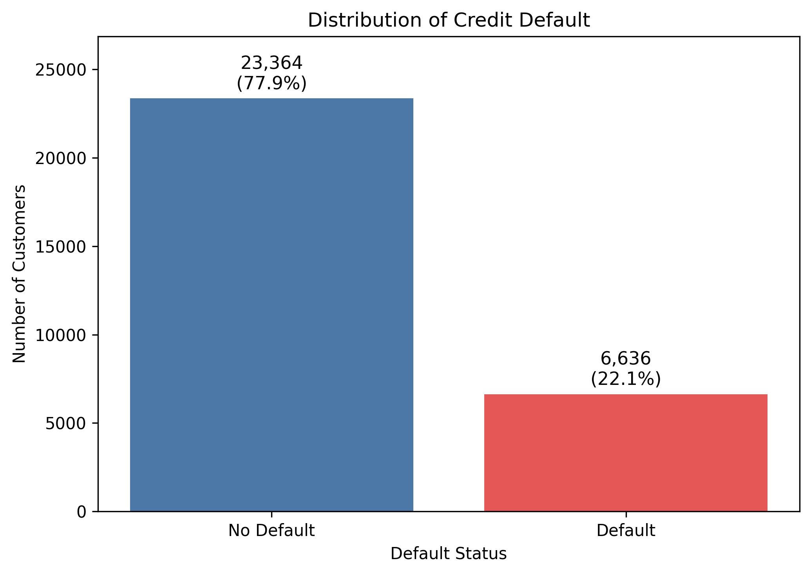
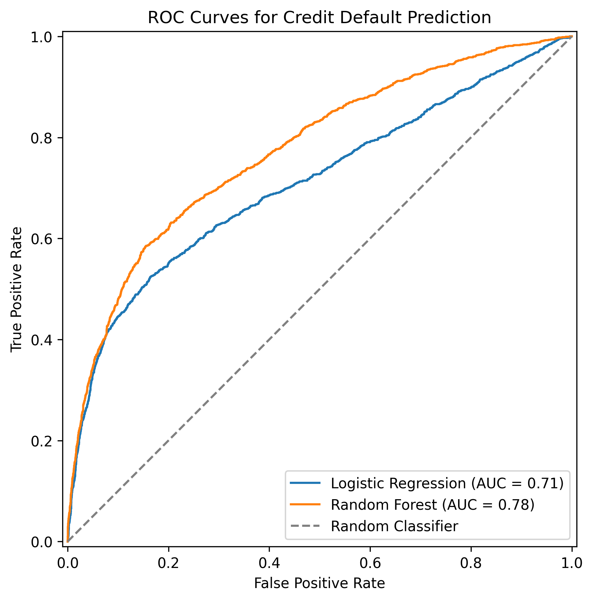
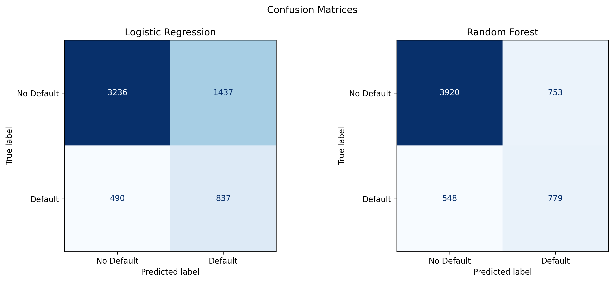
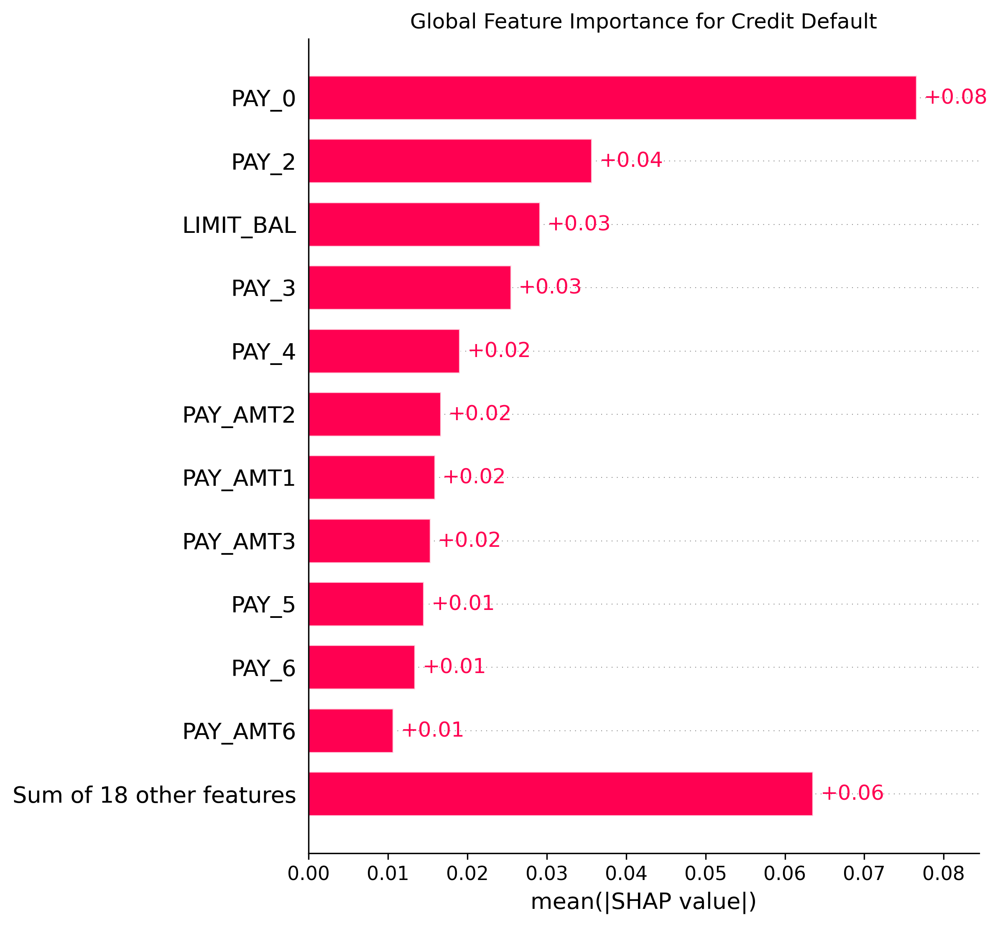
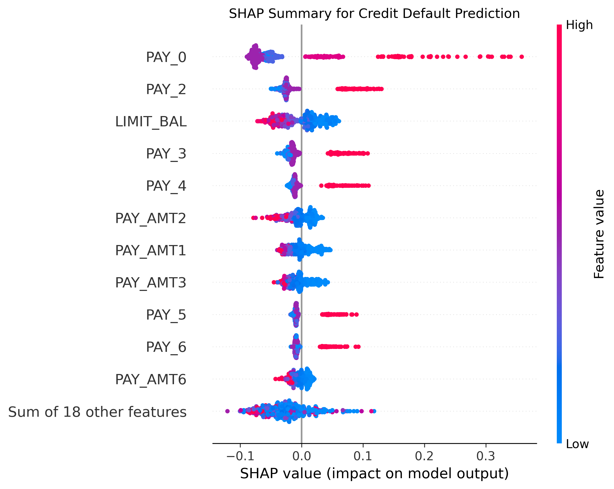
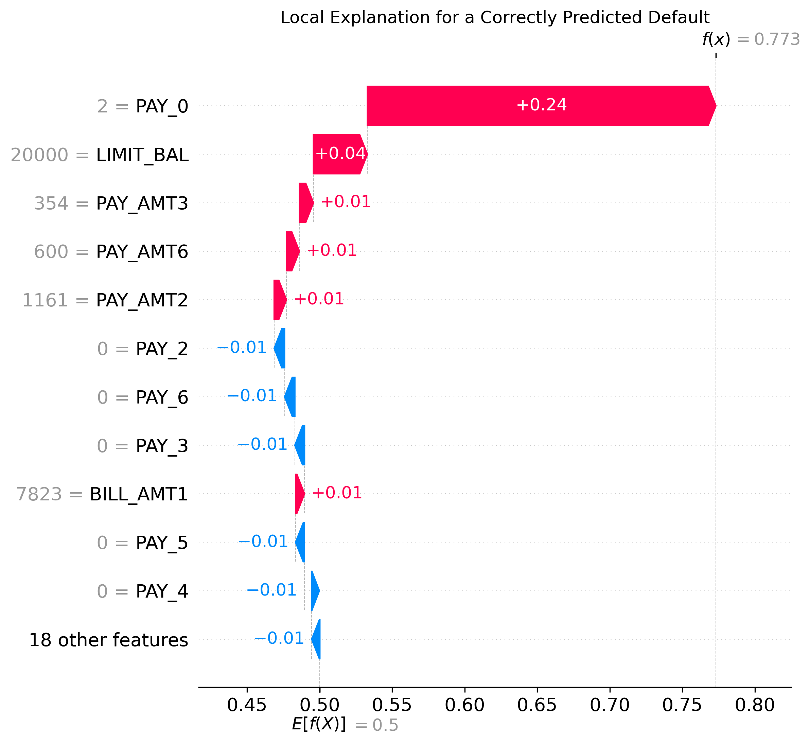

# Interpretable Credit Default Prediction

[](https://colab.research.google.com/github/Bony-39/interpretable-credit-default/blob/main/interpretable_credit_default.ipynb)

An end-to-end machine-learning project for credit default prediction using Logistic Regression, Random Forest, and SHAP explainability.

## Project Overview

Credit default prediction is an important application of machine learning in financial risk management. This project develops and compares two classification models and uses SHAP to explain their predictions.

The project focuses on both predictive performance and model interpretability.

## Dataset

The project uses the UCI Default of Credit Card Clients dataset, which contains demographic information, credit limits, repayment status, billing records, payment records, and default outcomes.

Data source: [UCI Machine Learning Repository](https://archive.ics.uci.edu/dataset/350/default+of+credit+card+clients)

## Workflow

1. Data loading and validation
2. Exploratory data analysis
3. Feature preprocessing
4. Train-test split
5. Logistic Regression modelling
6. Random Forest modelling
7. Model evaluation
8. SHAP global and local explanations

## Models

- Logistic Regression
- Random Forest Classifier

The models are evaluated using:

- ROC-AUC
- Precision
- Recall
- F1-score
- Confusion matrix

## Exploratory Data Analysis



## Model Evaluation





## Model Explainability

SHAP is used to examine the influence of individual features on the model's credit-default predictions.

### Global Feature Importance



### SHAP Beeswarm Plot



### Individual Prediction Explanation



## Repository Structure

```text
interpretable-credit-default/
├── figures/
├── interpretable_credit_default.ipynb
├── requirements.txt
├── README.md
├── LICENSE
└── .gitignore
How to Run
Install the required Python packages:
pip install -r requirements.txt
Then open and run:
interpretable_credit_default.ipynb
Alternatively, click the “Open in Colab” button at the top of this page.
Tools
- Python
- pandas and NumPy
- Matplotlib and Seaborn
- scikit-learn
- SHAP
- Google Colab
Limitations
This project is intended as an educational machine-learning study. The results should not be directly used for real-world lending decisions without further validation, fairness assessment, and regulatory review.
License
This project is released under the MIT License.
